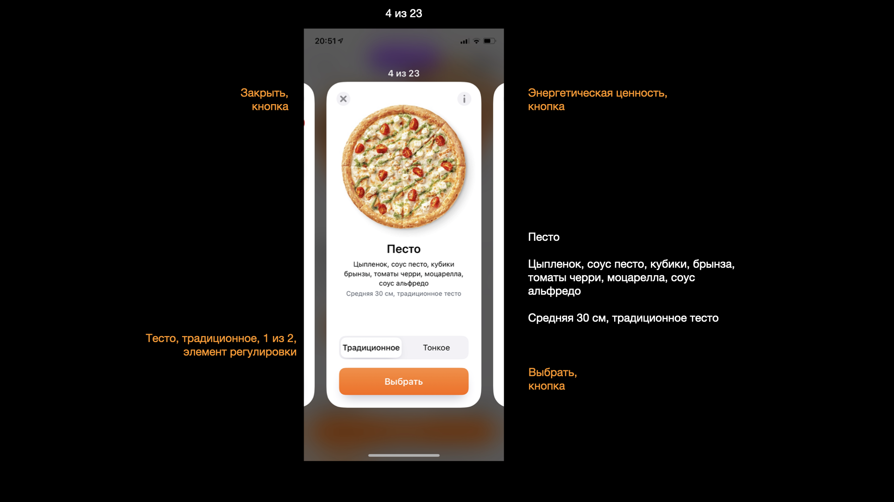

Конструктор комбо: горизонтальный список, внутри каждой ячейки несколько контролов. 

Контролов много, но модель простая: я выбираю один из продуктов, могу настроить у него теста, а всю остальное вторично. Попробуем  из карточки сделать единый доступный контрол. 
